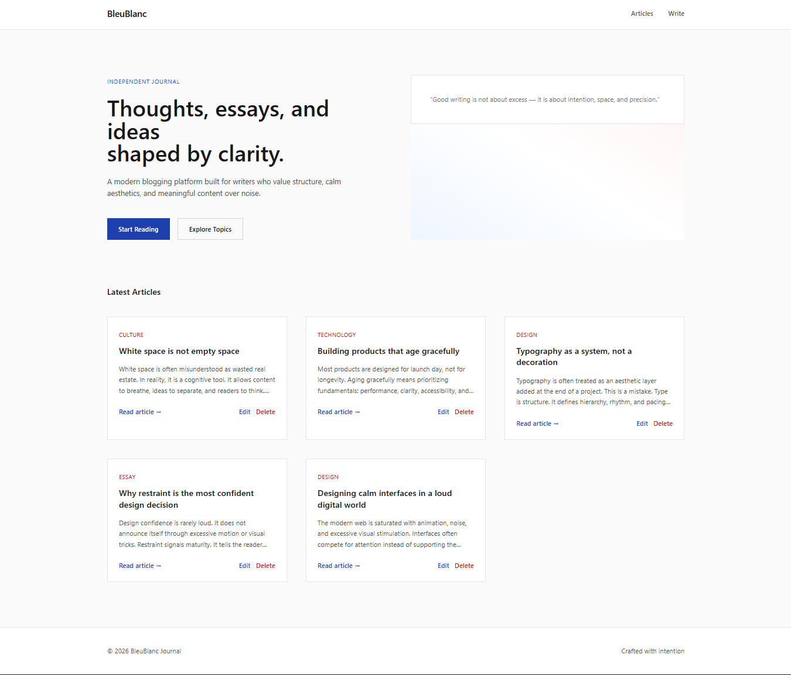
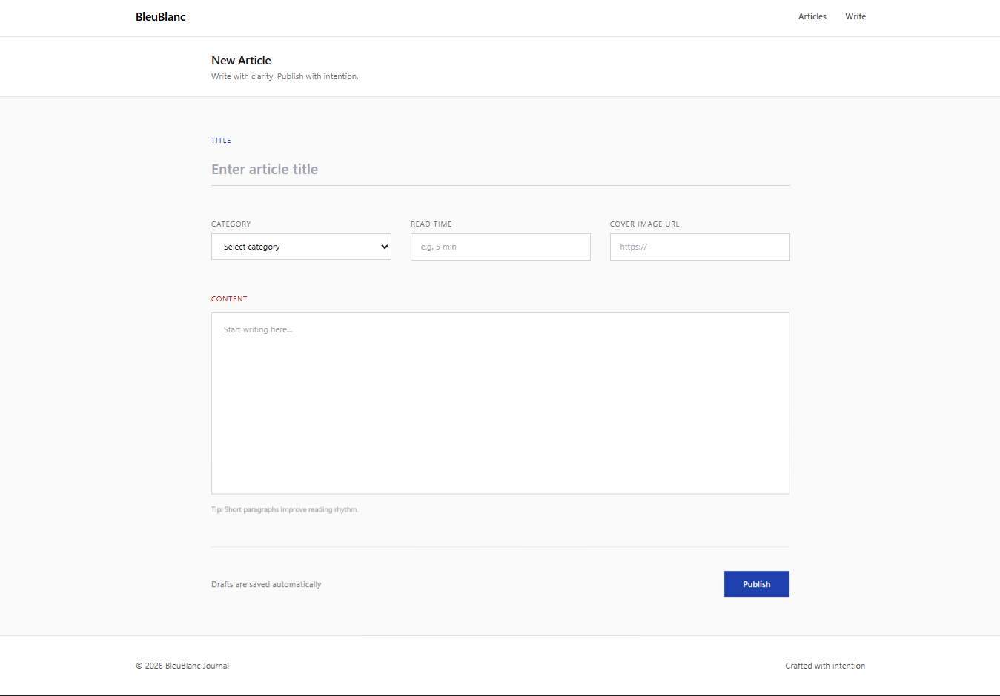
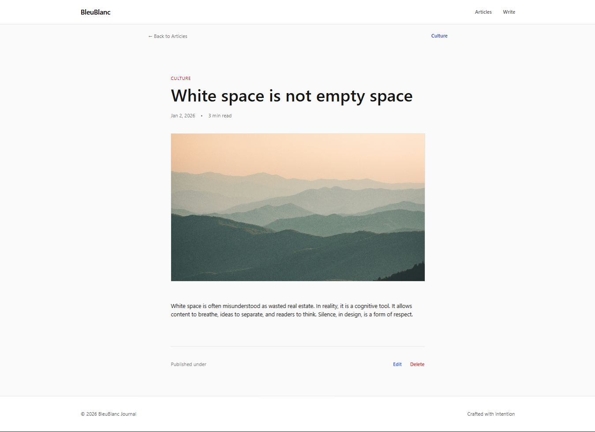
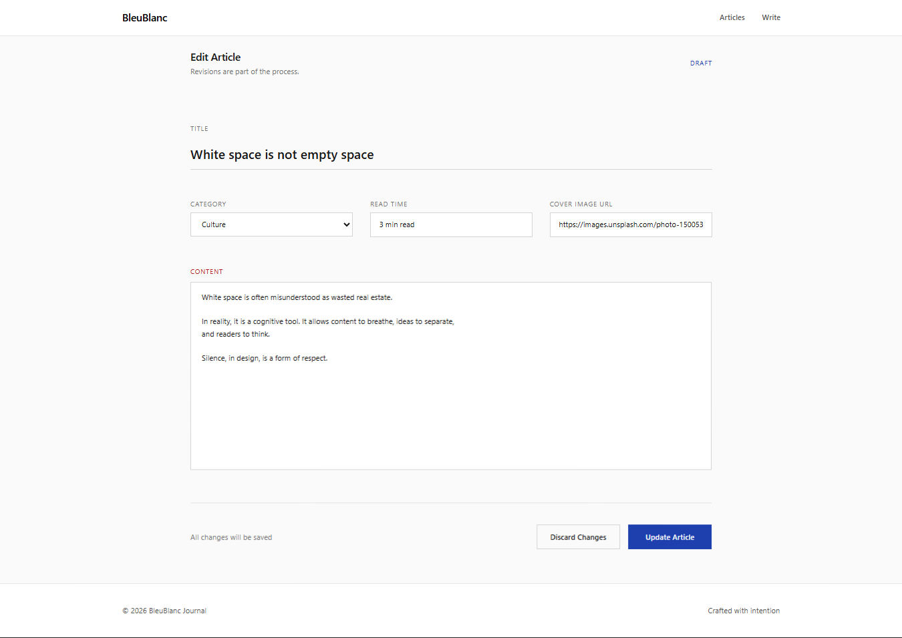

---

# BleuBlanc (MERN Blog Website)

A full-stack blog application built using the **MERN Stack** (MongoDB, Express, React, Node.js) that allows users to **create, read, update, and delete blogs**.

---

## Features

* Add new blog posts
* View all blogs
* Read individual blog details
* Edit existing blogs
* Delete blogs

---

## Tech Stack

* **Frontend:** React, Tailwind CSS
* **Backend:** Node.js, Express
* **Database:** MongoDB
* **API Client:** Axios

---

## Project Structure

```
/frontend
/backend
```

---

## Backend Setup

### Navigate to Backend Folder

```bash
cd backend
```

### Install Dependencies

```bash
npm install
```

### Environment Variables (`.env`)

Create a `.env` file inside the `backend` folder:

```env
PORT=5000
MONGO_URI=your_mongodb_connection_string
```

### Start Backend Server

```bash
npm run dev
```

or

```bash
npm start
```

Backend will run on:

```
http://localhost:5000
```

---

## Frontend Setup

### Navigate to Frontend Folder

```bash
cd frontend
```

### Install Dependencies

```bash
npm install
```

### Start Frontend Server

```bash
npm run dev
```

Frontend will run on:

```
http://localhost:5173
```

---

## Screenshots

### Home Page



### Add Blog Page



### Blog Detail Page



### Edit Blog Page


