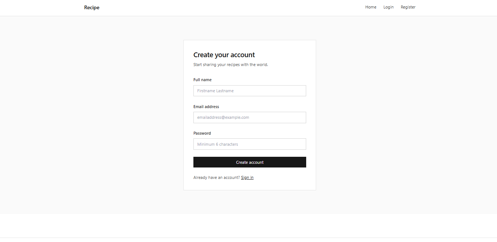
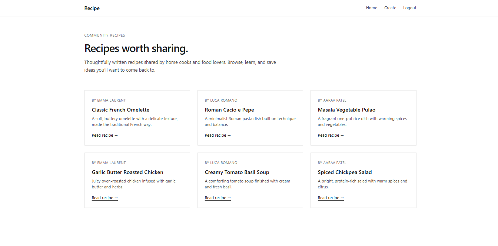
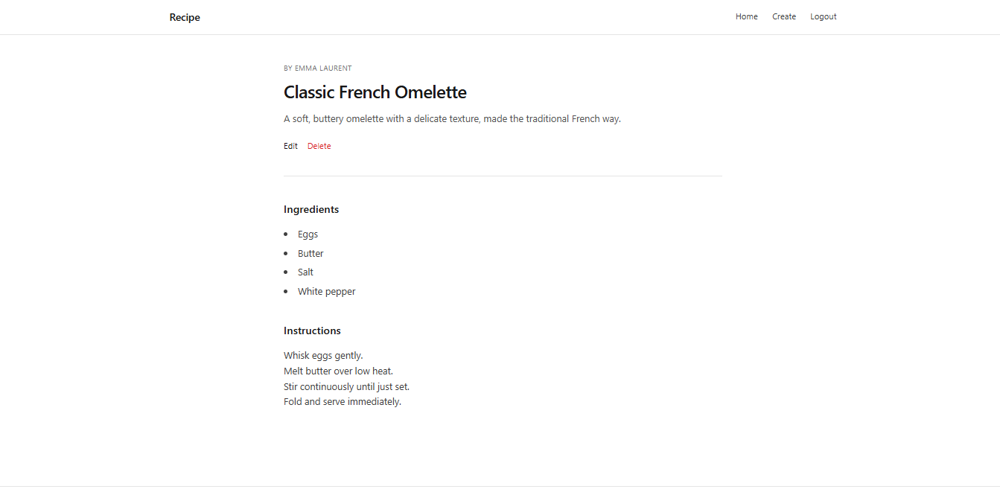
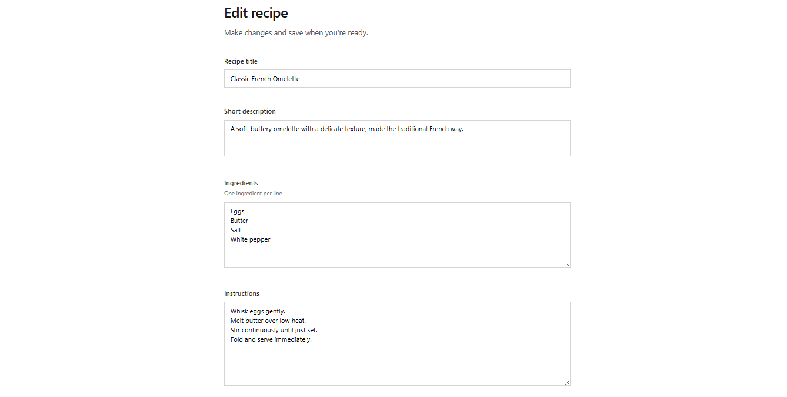

---

# RecipeBook (MERN Recipe Website)

A full-stack recipe application built using the **MERN Stack** (MongoDB, Express, React, Node.js) that allows users to **create, read, update, and delete recipes**.

---

## Features

* Register & Login
* Add new recipes
* View all recipes
* Read individual recipe details
* Edit your own recipes
* Delete your own recipes

---

## Tech Stack

* **Frontend:** React, Tailwind CSS
* **Backend:** Node.js, Express
* **Database:** MongoDB
* **API Client:** Axios

---

## Project Structure

```
/frontend
/backend
```

---

## Backend Setup

### Navigate to Backend Folder

```bash
cd backend
```

### Install Dependencies

```bash
npm install
```

### Environment Variables (`.env`)

Create a `.env` file inside the `backend` folder:

```env
PORT=5000
MONGO_URI=your_mongodb_connection_string
JWT_SECRET=super_secret_jwt_key
```

### Start Backend Server

```bash
npm run dev
```

or

```bash
npm start
```

Backend will run on:

```
http://localhost:5000
```

---

## Frontend Setup

### Navigate to Frontend Folder

```bash
cd frontend
```

### Install Dependencies

```bash
npm install
```

### Start Frontend Server

```bash
npm run dev
```

Frontend will run on:

```
http://localhost:5173
```

---

## Screenshots

### Register Page



### Login Page


### Home Page



### Recipe Detail Page



### Add Recipe Page


### Edit Recipe Page


